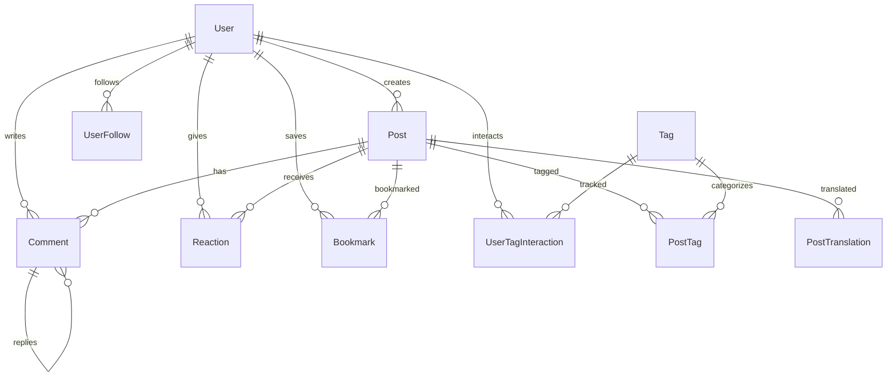

# SourceDev

<div align="center">

**Modern Developer Community Platform**

A full-stack content platform where developers can publish blog posts, interact with the community, and share knowledge.

[](https://nextjs.org/)
[](https://dotnet.microsoft.com/)
[](https://www.postgresql.org/)
[](https://opensource.org/licenses/MIT)

[Features](#features) • [Tech Stack](#tech-stack) • [Installation](#installation) • [API Documentation](#api-documentation) • [Contributing](#contributing)

</div>

---

## Table of Contents

- [Overview](#overview)
- [Features](#features)
- [Tech Stack](#tech-stack)
- [Project Structure](#project-structure)
- [Installation](#installation)
- [Environment Variables](#environment-variables)
- [Database Schema](#database-schema)
- [API Documentation](#api-documentation)
- [Frontend Routes](#frontend-routes)
- [Security](#security)
- [Contributing](#contributing)
- [License](#license)

---

## Overview

SourceDev is a modern, full-stack developer community platform built with Next.js and .NET 9.0. It provides a seamless experience for developers to:

- Write and publish technical blog posts with Markdown support
- Organize content with a powerful tagging system
- Engage with the community through comments and reactions
- Build personalized reading lists
- Follow other developers and discover relevant content
- Support multiple languages with built-in translation features

### Key Highlights

| Feature | Description |
|---------|-------------|
| **Architecture** | Monorepo with Next.js 16 App Router (SSR/ISR) frontend and ASP.NET Core 9.0 REST API backend |
| **Database** | PostgreSQL or SQL Server support with EF Core Code First migrations |
| **Authentication** | ASP.NET Identity + JWT with GitHub OAuth integration |
| **Performance** | In-memory caching, response compression, and rate limiting |
| **Developer Experience** | TypeScript, Tailwind CSS, AutoMapper, FluentValidation |

---

## Features

### User Features

- **Authentication & Authorization**
  - User registration and login (email/username + password)
  - GitHub OAuth integration for quick sign-up
  - Profile management (avatar, bio, social links)
  - Password change and reset functionality

### Content Features

- **Post Management**
  - Markdown-powered blog post creation and editing
  - Draft saving and publishing workflow
  - Tag-based categorization
  - Multi-language post translations
  - Full-text search capabilities

### Social Features

- **Community Engagement**
  - User follow system
  - Reaction system (heart, fire, unicorn, etc.)
  - Nested comments and replies
  - Reading list (bookmarks)
  - User-tag interaction tracking

### Content Discovery

- **Feed Algorithms**
  - **Latest**: Recently published posts
  - **Hot**: Trending posts with time-weighted scoring
  - **Top**: Most liked posts
  - **For You**: Personalized feed based on user interactions
  - Tag-based filtering

---

## Tech Stack

### Frontend

| Technology | Purpose |
|-----------|---------|
| **Next.js 16** | React framework with App Router |
| **React 19** | UI library |
| **Tailwind CSS 4** | Utility-first CSS framework |
| **Axios** | HTTP client |
| **Framer Motion** | Animation library |
| **react-markdown** | Markdown rendering |
| **EasyMDE** | Markdown editor |

### Backend

| Technology | Purpose |
|-----------|---------|
| **ASP.NET Core 9.0** | Web API framework |
| **Entity Framework Core 9** | ORM |
| **ASP.NET Identity** | Authentication system |
| **AutoMapper** | Object mapping |
| **FluentValidation** | Input validation |
| **MailKit** | Email service |

### Database & DevOps

| Technology | Purpose |
|-----------|---------|
| **PostgreSQL / SQL Server** | Primary database |
| **Docker** | Containerization |
| **Swagger/OpenAPI** | API documentation |

---

## Project Structure

```
SourceDev/
├── backend/
│   ├── Dockerfile
│   ├── railway.toml
│   └── SourceDev.API/
│       ├── Configuration/          # JWT & app settings
│       ├── Controllers/            # API endpoints
│       ├── Data/Context/           # EF Core DbContext
│       ├── DTOs/                   # Data transfer objects
│       ├── Extensions/             # Extension methods
│       ├── Mappings/               # AutoMapper profiles
│       ├── Middlewares/            # Custom middleware
│       ├── Migrations/             # EF Core migrations
│       ├── Models/Entities/        # Database entities
│       ├── Repositories/           # Repository pattern
│       ├── Services/               # Business logic
│       ├── Validators/             # FluentValidation rules
│       └── Program.cs
│
├── frontend/
│   ├── app/                        # Next.js App Router pages
│   │   ├── (feed)/                 # Feed pages group
│   │   ├── api/                    # API routes (OAuth)
│   │   ├── post/[id]/              # Dynamic post pages
│   │   ├── user/[username]/        # User profile pages
│   │   └── layout.js
│   ├── components/                 # React components
│   │   ├── Auth/
│   │   ├── Post/
│   │   ├── Comment/
│   │   └── UI/
│   ├── context/                    # React contexts
│   ├── utils/                      # Utilities & API client
│   └── next.config.mjs
│
└── README.md
```

---

## Installation

### Prerequisites

Before you begin, ensure you have the following installed:

- [.NET 9 SDK](https://dotnet.microsoft.com/download/dotnet/9.0)
- [Node.js 20+](https://nodejs.org/)
- [PostgreSQL](https://www.postgresql.org/) or SQL Server
- [Git](https://git-scm.com/)

### Step 1: Clone the Repository

```bash
git clone https://github.com/yourusername/SourceDev.git
cd SourceDev
```

### Step 2: Backend Setup

```bash
cd backend/SourceDev.API

# Copy environment variables template
cp env.example.txt .env

# Edit .env with your configuration
nano .env

# Restore dependencies
dotnet restore

# Apply database migrations
dotnet ef database update

# Run the API
dotnet run
```

The backend API will be available at `http://localhost:5000`

### Step 3: Frontend Setup

```bash
cd frontend

# Copy environment variables template
cp env.example.txt .env.local

# Edit .env.local with your configuration
nano .env.local

# Install dependencies
npm install

# Run development server
npm run dev
```

The frontend will be available at `http://localhost:3000`

### Step 4: Production Build

```bash
# Backend
cd backend/SourceDev.API
dotnet publish -c Release -o ./publish

# Frontend
cd frontend
npm run build
npm run start
```

---

## Environment Variables

### Backend Configuration

Create a `.env` file in `backend/SourceDev.API/`:

```env
# Database Connection
CONNECTION_STRING=Host=localhost;Database=SourceDev;Username=postgres;Password=your_password

# JWT Settings
JWT_SECRET_KEY=your-super-secret-key-at-least-32-characters-long
JWT_ISSUER=SourceDev
JWT_AUDIENCE=SourceDevApp
JWT_EXPIRATION_MINUTES=60

# CORS Settings
ALLOWED_ORIGINS=http://localhost:3000

# Environment
ASPNETCORE_ENVIRONMENT=Development

# Email Configuration (Optional)
SMTP_HOST=smtp.gmail.com
SMTP_PORT=587
SMTP_USER=your-email@gmail.com
SMTP_PASSWORD=your-app-password
```

### Frontend Configuration

Create a `.env.local` file in `frontend/`:

```env
# API URL
NEXT_PUBLIC_API_URL=http://localhost:5000/api

# GitHub OAuth
GITHUB_CLIENT_ID=your_github_oauth_client_id
GITHUB_CLIENT_SECRET=your_github_oauth_client_secret
GITHUB_OAUTH_REDIRECT=http://localhost:3000/api/oauth/github/callback
GITHUB_OAUTH_PEPPER=random-secure-string-for-encryption

# Optional: Analytics
NEXT_PUBLIC_GA_ID=your_google_analytics_id
```

### Obtaining GitHub OAuth Credentials

1. Go to [GitHub Developer Settings](https://github.com/settings/developers)
2. Click "New OAuth App"
3. Fill in the details:
   - **Application name**: SourceDev Local
   - **Homepage URL**: `http://localhost:3000`
   - **Authorization callback URL**: `http://localhost:3000/api/oauth/github/callback`
4. Copy the Client ID and generate a Client Secret
5. Add them to your `.env.local` file

---

## Database Schema

### Entity Relationship Diagram



### Core Entities

| Entity | Description |
|--------|-------------|
| **User** | User accounts (ASP.NET Identity based) |
| **Post** | Blog posts with content and metadata |
| **PostTranslation** | Multi-language support for posts |
| **Comment** | Nested comments and replies |
| **Tag** | Content categorization tags |
| **PostTag** | Many-to-many relationship between posts and tags |
| **Reaction** | Post reactions (like, fire, unicorn, etc.) |
| **Bookmark** | User reading list items |
| **UserFollow** | User following relationships |
| **UserTagInteraction** | Tracks user engagement with tags |

---

## API Documentation

All API endpoints are prefixed with `/api`. Endpoints requiring authentication need the `Authorization: Bearer <token>` header.

### Authentication Endpoints

| Method | Endpoint | Description | Auth Required |
|--------|----------|-------------|---------------|
| `POST` | `/api/auth/register` | Register new user | No |
| `POST` | `/api/auth/login` | User login | No |
| `POST` | `/api/auth/logout` | Logout (blacklist token) | Yes |
| `POST` | `/api/auth/change-password` | Change password | Yes |
| `POST` | `/api/auth/validate-token` | Validate JWT token | No |
| `GET` | `/api/auth/profile` | Get user profile | Yes |
| `PUT` | `/api/auth/profile` | Update profile | Yes |
| `POST` | `/api/auth/forgot-password` | Request password reset | No |
| `POST` | `/api/auth/reset-password` | Reset password | No |

### Post Endpoints

| Method | Endpoint | Description | Auth Required |
|--------|----------|-------------|---------------|
| `GET` | `/api/post/{id}` | Get post by ID | No |
| `GET` | `/api/post/slug/{slug}` | Get post by slug | No |
| `GET` | `/api/post/latest` | Latest posts | No |
| `GET` | `/api/post/hot` | Trending posts | No |
| `GET` | `/api/post/top` | Top rated posts | No |
| `GET` | `/api/post/for-you` | Personalized feed | Yes |
| `GET` | `/api/post/user/{userId}` | User's posts | No |
| `GET` | `/api/post/tag/{tagSlug}` | Posts by tag | No |
| `GET` | `/api/post/drafts` | User's drafts | Yes |
| `GET` | `/api/post/bookmarks` | Reading list | Yes |
| `GET` | `/api/post/search` | Search posts | No |
| `POST` | `/api/post` | Create post | Yes |
| `PUT` | `/api/post/{id}` | Update post | Yes |
| `PUT` | `/api/post/{id}/publish` | Publish post | Yes |
| `PUT` | `/api/post/{id}/unpublish` | Unpublish post | Yes |
| `DELETE` | `/api/post/{id}` | Delete post | Yes |
| `POST` | `/api/post/{id}/like` | Toggle like | Yes |
| `POST` | `/api/post/{id}/save` | Toggle bookmark | Yes |

### Comment Endpoints

| Method | Endpoint | Description | Auth Required |
|--------|----------|-------------|---------------|
| `GET` | `/api/comment/post/{postId}` | Get post comments | No |
| `GET` | `/api/comment/post/{postId}/count` | Comment count | No |
| `POST` | `/api/comment/post/{postId}` | Add comment | Yes |
| `DELETE` | `/api/comment/{commentId}` | Delete comment | Yes |
| `GET` | `/api/comment/search` | Search comments | No |

### Reaction Endpoints

| Method | Endpoint | Description | Auth Required |
|--------|----------|-------------|---------------|
| `POST` | `/api/reaction/post/{postId}` | Toggle reaction | Yes |
| `DELETE` | `/api/reaction/post/{postId}` | Remove reaction | Yes |
| `GET` | `/api/reaction/post/{postId}/summary` | Reaction summary | No |

### Follow Endpoints

| Method | Endpoint | Description | Auth Required |
|--------|----------|-------------|---------------|
| `POST` | `/api/follow/{userId}` | Follow user | Yes |
| `DELETE` | `/api/follow/{userId}` | Unfollow user | Yes |
| `GET` | `/api/follow/check/{userId}` | Check follow status | Yes |
| `GET` | `/api/follow/followers/{userId}` | Get followers | No |
| `GET` | `/api/follow/following/{userId}` | Get following | No |

### Tag Endpoints

| Method | Endpoint | Description | Auth Required |
|--------|----------|-------------|---------------|
| `GET` | `/api/tag` | All tags | No |
| `GET` | `/api/tag/popular` | Popular tags | No |
| `GET` | `/api/tag/search` | Search tags | No |
| `GET` | `/api/tag/{id}` | Tag details by ID | No |
| `GET` | `/api/tag/name/{name}` | Tag details by name | No |
| `POST` | `/api/tag` | Create tag | Yes |

### User Endpoints

| Method | Endpoint | Description | Auth Required |
|--------|----------|-------------|---------------|
| `GET` | `/api/users` | All users | No |
| `GET` | `/api/users/active` | Active users | No |
| `GET` | `/api/users/search` | Search users | No |
| `GET` | `/api/users/{id}` | User profile by ID | No |
| `GET` | `/api/users/username/{username}` | User profile by username | No |

### Admin Endpoints

| Method | Endpoint | Description | Auth Required |
|--------|----------|-------------|---------------|
| `GET` | `/api/admin/stats` | Platform statistics | Admin |
| `GET` | `/api/admin/users` | User management | Admin |
| `PUT` | `/api/admin/users/{id}/role` | Change user role | Admin |
| `DELETE` | `/api/admin/users/{id}` | Delete user | Admin |
| `DELETE` | `/api/admin/posts/{id}` | Delete post (admin) | Admin |
| `DELETE` | `/api/admin/comments/{id}` | Delete comment (admin) | Admin |

---

## Frontend Routes

| Route | Description | Auth Required |
|-------|-------------|---------------|
| `/` | Home feed | No |
| `/reading-list` | Bookmarked posts | Yes |
| `/drafts` | User drafts | Yes |
| `/post/[id]` | Post detail page | No |
| `/tag/[tagname]` | Tag page | No |
| `/search` | Search results | No |
| `/user/[username]` | User profile | No |
| `/dashboard` | User dashboard | Yes |
| `/create-post` | Create new post | Yes |
| `/settings` | User settings | Yes |
| `/login` | Login page | No |
| `/register` | Registration page | No |
| `/forgot-password` | Password reset | No |
| `/change-password` | Change password | Yes |
| `/about` | About page | No |
| `/contact` | Contact page | No |

---

## Security

### Authentication & Authorization

- **ASP.NET Identity** for user management
- **JWT (JSON Web Token)** based authentication
- **Token blacklist** mechanism (invalidate tokens on logout)
- **GitHub OAuth 2.0** integration
- **Role-based access control** (RBAC): User, Admin roles
- **Endpoint-level authorization** with `[Authorize]` attribute

### Security Measures

| Feature | Implementation |
|---------|----------------|
| **CORS** | Dynamic CORS middleware with origin validation |
| **Input Validation** | FluentValidation for all DTOs |
| **Rate Limiting** | Built-in rate limiting to prevent abuse |
| **SQL Injection** | EF Core parameterized queries |
| **XSS Protection** | rehype-sanitize for markdown rendering |
| **Password Security** | Hashed with ASP.NET Identity (PBKDF2) |
| **HTTPS** | Enforced in production |

---

## Contributing

We welcome contributions! Please follow these steps:

### 1. Fork the Repository

Click the "Fork" button at the top right of this page.

### 2. Create a Feature Branch

```bash
git checkout -b feature/amazing-feature
```

### 3. Make Your Changes

- Write clean, documented code
- Follow existing code style
- Add tests for new features
- Update documentation as needed

### 4. Commit Your Changes

```bash
git commit -m "Add amazing feature"
```

### 5. Push to Your Fork

```bash
git push origin feature/amazing-feature
```

### 6. Open a Pull Request

Go to the original repository and click "New Pull Request"

### Development Guidelines

- Write descriptive commit messages
- Include unit tests for new features
- Follow existing code style and conventions
- Update documentation for API changes
- PRs require at least one review before merging

### Reporting Issues

Found a bug or have a feature request? Please [open an issue](https://github.com/eminnates/SourceDev/issues/new) with:

- Clear title and description
- Steps to reproduce (for bugs)
- Expected vs actual behavior
- Screenshots if applicable

---

## License

This project is licensed under the MIT License - see the [LICENSE](LICENSE) file for details.

```
MIT License

Copyright (c) 2024 SourceDev

Permission is hereby granted, free of charge, to any person obtaining a copy
of this software and associated documentation files (the "Software"), to deal
in the Software without restriction...
```

---

## Contact & Links

<div align="center">

**SourceDev** - Building the future of developer communities

[](https://sourcedev.tr)
[](https://github.com/eminnates/SourceDev)

Made with by the SourceDev Team

</div>

---

## Acknowledgments

- Thanks to all [contributors](https://github.com/eminnates/SourceDev/graphs/contributors)
- Inspired by [Dev.to](https://dev.to) and [Hashnode](https://hashnode.com)
- Built with amazing open-source technologies

---

<div align="center">

**[Back to Top](#sourcedev)**

</div>
